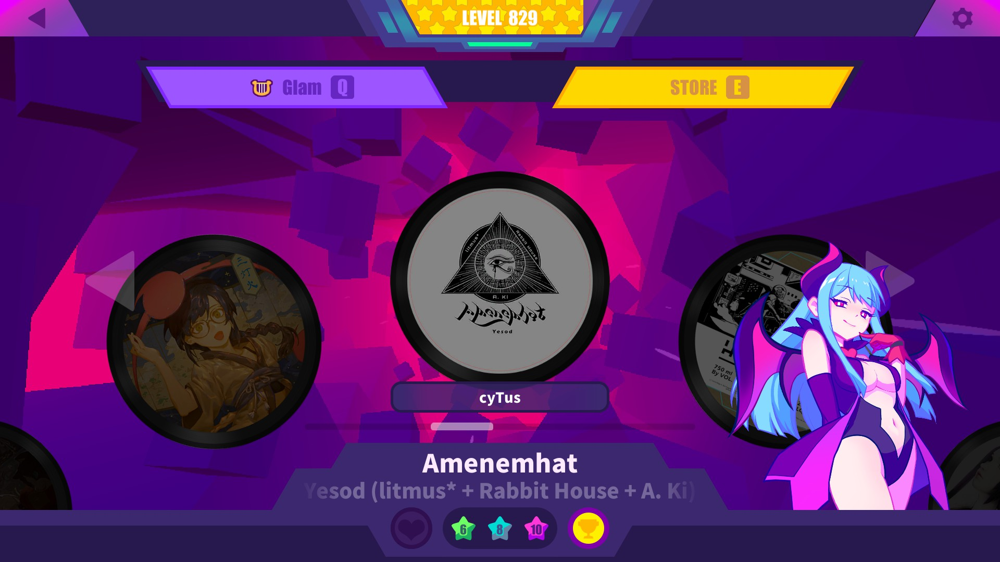
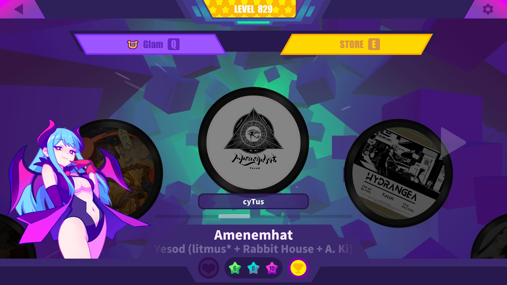
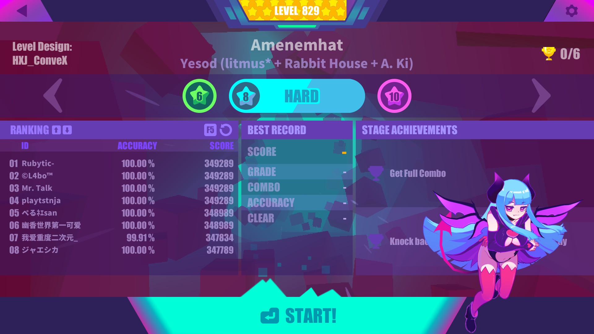

# MenuCharacter

Display your favorite character on stage!

## ❗Check out my other [mods](https://github.com/Asgragrt/AsgraMDMods/blob/main/README.md)❗

## Features

* Display your favorite character on stage and preparation scenes.
* Control each character options individually.
* Hot-reload changes in your settings file.

## Settings

The config file can be found at `${Your muse dash folder}/UserData/MenuCharacter.cfg`.

* All string options are **case insensitive**.
* See [examples](#examples) for examples and in-game screenshots.

### MenuCharacter

* `DebugLog` enable it if you want to spam your console with debug messages lol.

### StageGirl and PreparationGirl

Each character has their own individual options.

* `IsEnabled` whether to enable/disable the character.
* `TrackType` display your current character or one chosen below.
  * `Selected` uses your current selected character.
  * `Fixed` uses the characters on `StageGirl` and `PreparationGirl`.
* `GirlShow` selects the sprite.
  * `Main` uses the main sprite.
  * `Victory` uses the victory sprite.
  * `Fail` uses the fail sprite.
* `StageGirl` and `PreparationGirl` selects the character to display if `TrackType` is `Fixed`
  \(See [character list](#character-list) for an exhaustive listing of accepted values\).
* `FlipGirl` whether to flip the sprite or not.
* `ScreenSide` whether to display on the right or left side of the screen.

## Character list

> [!WARNING]  
> RinRacer Fail Show sprite is way too big. For decent results use `ScreenSide: Left | FlipGirl: False` or `ScreenSide: Right | FlipGirl: True`.
>
> MarijaDancer Victory Show hand :/ (too lazy to just change its sorting order lol)

* `RinBassist`
* `RinBadGirl`
* `RinSleepwalkerGirl`
* `RinBunnyGirl`
* `BuroPilot`
* `BuroIdol`
* `BuroZombieGirl`
* `BuroJoker`
* `MarijaViolinist`
* `MarijaMaid`
* `MarijaMagicalGirl`
* `MarijaLittleDevil`
* `MarijaTheGirlInBlack`
* `RinChristmasGift`
* `BuroSailorSuit`
* `Yume`
* `Neko`
* `RinPartTimeWarrior`
* `HakureiReimu`
* `ElClear`
* `MarijaSister`
* `KirisameMarisa`
* `Amiya`
* `OlaBoxer`
* `BuroExorcistMaster`
* `HatsuneMiku`
* `KagamineRinLen`
* `RinRacer`
* `MarijaDancer`

## Installation

### Prerequisites

* Make sure you have `MelonLoader 0.6.1` or higher installed and working on your Muse Dash.

### Steps

1. Download the latest release from [releases](https://github.com/Asgragrt/MenuCharacter/releases/latest).
2. Move `MenuCharacter.dll` to `${Your muse dash folder}/Mods`.
3. Enjoy!

## Examples

### Default

* ``DebugLog = false``

#### StageGirl

* ``IsEnabled = true``
* ``TrackType = "Fixed"``
* ``GirlShow = "Victory"``
* ``StageGirl = "MarijaLittleDevil"``
* ``FlipGirl = true``
* ``ScreenSide = "Right"``

### Flip

* ``DebugLog = false``

#### StageGirl

* ``IsEnabled = true``
* ``TrackType = "Fixed"``
* ``GirlShow = "Victory"``
* ``StageGirl = "MarijaLittleDevil"``
* ``FlipGirl = false``
* ``ScreenSide = "Right"``

### Left side

* ``DebugLog = false``

#### StageGirl

* ``IsEnabled = true``
* ``TrackType = "Fixed"``
* ``GirlShow = "Victory"``
* ``StageGirl = "MarijaLittleDevil"``
* ``FlipGirl = false``
* ``ScreenSide = "Left"``

### Main show

* ``DebugLog = false``

#### PreparationGirl

* ``IsEnabled = true``
* ``TrackType = "Fixed"``
* ``GirlShow = "Main"``
* ``PreparationGirl = "MarijaLittleDevil"``
* ``FlipGirl = false``
* ``ScreenSide = "Right"``

### Fail show

* ``DebugLog = false``

#### PreparationGirl

* ``IsEnabled = true``
* ``TrackType = "Fixed"``
* ``GirlShow = "Main"``
* ``PreparationGirl = "MarijaLittleDevil"``
* ``FlipGirl = false``
* ``ScreenSide = "Right"``

